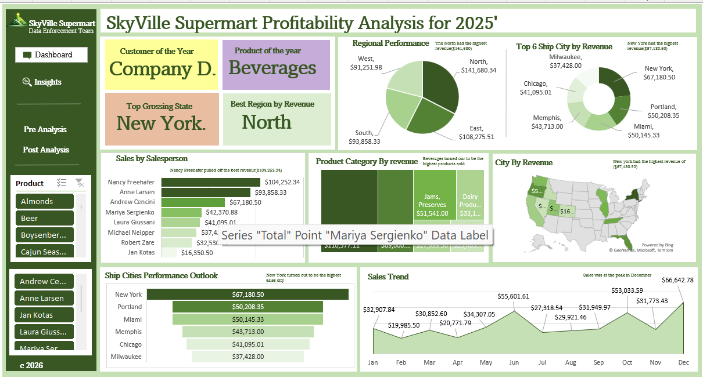

# Concentration Risk: SkyVille Supermart Revenue Analysis

An end-to-end Excel data analysis project uncovering how concentrated a supermarket's revenue really is among its customers and salespeople, work a simple regional revenue view would never reveal.



## Overview

SkyVille Supermart had a full year of order level data spread across 26 fields, order, shipping, customer, and product details, but no consolidated view of where revenue was actually concentrated. This project analyzes 369 orders to build an interactive Excel dashboard and technical report that expose customer and salesperson concentration risk alongside regional and category performance.

## Key Finding

Just **3 of 15 customers** generated **37.0%** of total revenue, and just **2 of 8 salespeople** generated **45.5%** of it. Nearly half the business runs through two individuals, and over a third of revenue sits with three accounts, a risk that would stay invisible in a simple region or category breakdown.

## Dataset

| Attribute | Detail |
|---|---|
| Records | 369 order lines |
| Time period | Jan to Dec, 2014 |
| Customers | 15 business accounts |
| Salespeople | 8 |
| Product categories | 14 |
| Regions | 4 (North, East, South, West) |
| States / Ship cities | 12 / 12 |
| Fields | Order ID, Date, Customer, Region, State, City, Salesperson, Shipped Date, Shipper, Payment Type, Product, Category, Unit Price, Quantity, Revenue, Shipping Fee |

## Tools and Methods

- **Microsoft Excel**: PivotTables, PivotCharts, Slicers, filled map chart, dashboard design
- 9 PivotTables built to summarize revenue by region, state, ship city, salesperson, customer, category, and month
- Donut charts, a treemap, a geographic filled map, and an area trend chart used to compare performance across dimensions
- Interactive slicer for Product Name

## Key Insights

- **Customer concentration**: Top 3 of 15 customers (Company D, Company H, Company BB) generate 37.0% of total revenue; Company D alone accounts for 15.4%.
- **Salesperson concentration**: Top 2 of 8 salespeople generate 45.5% of total revenue, a business continuity risk if either departs.
- **Regional performance**: North leads on revenue ($141.7K, 32.6% of total); East has the highest average order value ($1,230.40) despite trailing North on total revenue.
- **Category leader**: Beverages drives 25.4% of total revenue, more than the next two categories combined.
- **Seasonality**: Revenue peaks in December ($66,642.78) and June ($55,601.61), with February and April as the weakest months.
- **Data quality gaps found**: 27.6% of orders missing Payment Type, 3 order lines with a mislabeled "Shipping Fee" category, and a dashboard title year that doesn't match the underlying 2014 order dates, all flagged for correction.

## Repository Contents

```
├── dashboard.png                       # Dashboard screenshot
├── TASK19_ANYAOGU_..._CUSTOMIZED.xlsx  # Source workbook (raw data, PivotTables, dashboard)
├── SkyVille_Technical_Report.docx      # Full technical report
└── README.md
```

## Skills Demonstrated

Excel PivotTables and PivotCharts, dashboard design, slicer-based interactivity, geographic (map) visualization, data quality auditing, concentration and risk analysis, data storytelling, technical report writing.

## Author

Anyaogu Obinna Ogochukwu
